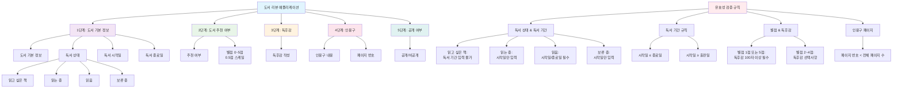

```mermaid
graph TD
    A[도서 리뷰 애플리케이션] --> B[1단계: 도서 기본 정보]
    A --> C[2단계: 도서 추천 여부]
    A --> D[3단계: 독후감]
    A --> E[4단계: 인용구]
    A --> F[5단계: 공개 여부]
    
    B --> B1[도서 기본 정보]
    B --> B2[독서 상태]
    B --> B3[독서 시작일]
    B --> B4[독서 종료일]
    
    B2 --> B21["읽고 싶은 책"]
    B2 --> B22["읽는 중"]
    B2 --> B23["읽음"]
    B2 --> B24["보류 중"]
    
    C --> C1[추천 여부]
    C --> C2[별점 0~5점<br/>0.5점 스케일]
    
    D --> D1[독후감 작성]
    
    E --> E1[인용구 내용]
    E --> E2[페이지 번호]
    
    F --> F1[공개/비공개]
    
    %% 유효성 검증 규칙
    G[유효성 검증 규칙] --> G1[독서 상태 & 독서 기간]
    G --> G2[독서 기간 규칙]
    G --> G3[별점 & 독후감]
    G --> G4[인용구 페이지]
    
    G1 --> G11["읽고 싶은 책:<br/>독서 기간 입력 불가"]
    G1 --> G12["읽는 중:<br/>시작일만 입력"]
    G1 --> G13["읽음:<br/>시작일/종료일 필수"]
    G1 --> G14["보류 중:<br/>시작일만 입력"]
    
    G2 --> G21["시작일 ≤ 종료일"]
    G2 --> G22["시작일 ≥ 출판일"]
    
    G3 --> G31["별점 1점 또는 5점:<br/>독후감 100자 이상 필수"]
    G3 --> G32["별점 2~4점:<br/>독후감 선택사항"]
    
    G4 --> G41["페이지 번호 < 전체 페이지 수"]
    
    style A fill:#e1f5fe
    style B fill:#f3e5f5
    style C fill:#e8f5e8
    style D fill:#fff3e0
    style E fill:#fce4ec
    style F fill:#e0f2f1
    style G fill:#ffebee
```